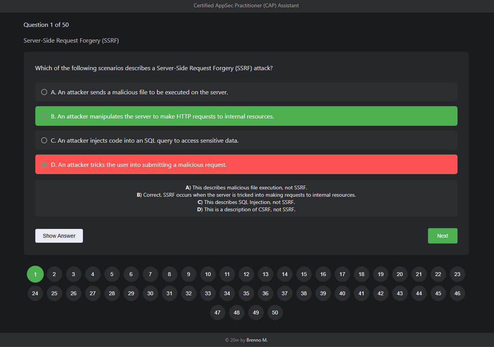

    
    <h2 align="center">Unofficial Assistant for Certified AppSec Practitioner (CAP)</h2> 
      Project created to assist in preparation for the Certified AppSec Practitioner (CAP) by The SecOps Group. It is a website with 50 questions of a difficulty level similar to that of the exam.
          
            
         
  

### Questions by topic:

- Server-Side Request Forgery (SSRF): 2 questions
- Insecure Direct Object Reference (IDOR): 3 questions
- Authentication Vulnerabilities: 3 questions
- Input Validation: 1 question
- Cross-Site Scripting (XSS): 3 questions
- Security Headers: 3 questions
- TLS Security: 4 questions
- Common Supply Chain Attacks: 3 questions
- Directory Traversal Vulnerabilities: 4 questions
- Business Logic Flaws: 4 questions
- Insecure File Uploads: 2 questions
- Code Injection Vulnerabilities: 2 questions
- Security Misconfigurations: 2 questions
- Information Disclosure: 3 questions
- Vulnerable and Outdated Components: 2 questions
- Cross-Site Request Forgery (CSRF): 2 questions
- Encoding, Encryption, and Hashing: 2 questions
- SQL Injection: 2 questions
- Privilege Escalation: 2 questions
- JWT (JSON Web Token): 2 questions
- Server Information Disclosure: 2 questions
- Content-Security-Policy (CSP): 2 questions
- XML External Entity (XXE) Attack: 2 questions
- Security Best Practices and Hardening Mechanisms: 1 question

 

Link: [https://cap-assistant.ct.ws](https://cap-assistant.ct.ws)

